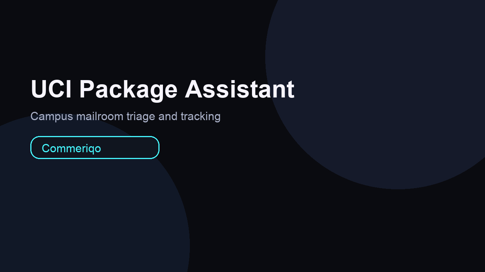

# Commeriqo — Intelligent Shopping Assistant

Commeriqo is an AI-powered e-commerce chatbot that handles product discovery, smart recommendations, order tracking, and FAQs. It also includes a **UCI Student Package Assistant** for on-campus mailroom delays. The system combines lightweight ML intent classification (TF-IDF + Logistic Regression), semantic product matching, and personalization based on user actions.

## Screenshots



## Features
- ML intent classification (greeting, product search, recommendations, order tracking, refund, FAQ, UCI package help)
- Confidence meter with top-intent suggestions
- Product search with price filtering
- Semantic recommendations (word + character n-grams)
- Smart bundle builder for starter kits
- Personalized re-ranking based on Add/Save/Compare
- Order tracking + status cards
- UCI Student Package Assistant with triage flows
- Modern neon UI

## Tech Stack
- Backend: FastAPI (Python)
- ML/NLP: scikit-learn, TF-IDF, Logistic Regression
- Data: JSON files (products, orders, intents, UCI packages)
- Frontend: HTML/CSS/JS

## Why It Matters
Commeriqo reduces customer support load while improving shopper experience with fast, accurate answers. The UCI package assistant directly addresses campus delivery delays by guiding students through package status checks and follow-ups.

## Project Structure
```
ecommerce-ai-chatbot/
├── backend/
│   ├── app.py
│   ├── model.py
│   ├── intents.json
│   ├── products.json
│   ├── orders.json
│   ├── uci_packages.json
│   └── artifacts/
├── docs/
│   ├── thumbnail.png
│   ├── ui-main.png
│   └── uci-assistant.png
├── frontend/
│   ├── index.html
│   ├── style.css
│   └── script.js
├── requirements.txt
└── README.md
```

## Run Locally
1. Create a virtual environment and install dependencies
```
python3 -m venv .venv
source .venv/bin/activate
pip install -r requirements.txt
```

2. Start the backend
```
uvicorn backend.app:app --reload
```

3. Open the frontend
Open `frontend/index.html` in a browser.

## Example Prompts
- "Show me running shoes under $100"
- "Recommend a camera for travel"
- "Track order 1234"
- "What is your return policy?"
- "UCI package help for UCI-1001"

## Notes
- The intent model auto-trains on first run and is saved to `backend/artifacts/intent_model.joblib`.
- You can add more products or intents by editing the JSON files.

## Future Improvements
- Persistent chat memory on the backend
- Multilingual intent detection
- RAG over a real product database
- Admin dashboard for support teams
